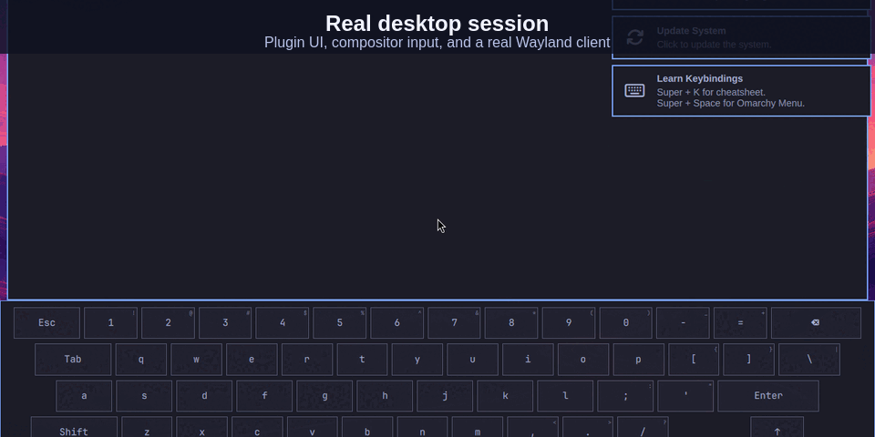

# Omarchy Plugin Lab

> A disposable KVM desktop for proving Omarchy plugins where they actually run.



Omarchy Plugin Lab is a local environment for developing and testing Omarchy
plugins, Hyprland integrations, Quickshell components, and native desktop
behavior—without using the daily host installation as a test target.

It is built for the boundaries unit tests cannot settle: a fresh graphical
login, a real compositor, global shortcuts, pointer input, shell lifecycle,
hot reloads, and the artifacts needed to explain a result later.

## What it makes practical

| Build | Prove in the lab |
| --- | --- |
| A Quickshell plugin | Install, enable, disable, re-enable, remove, and clean up in a real shell session |
| A Hyprland shortcut or UI control | The actual QMP key or pointer event reaches the visible control and has the expected effect |
| A hot-reloadable widget or service | The loaded runtime—not just the files on disk—matches the version and behavior you shipped |
| An installer, package, systemd, or `/etc` change | A local ISO installs and passes desktop acceptance from a fresh base |

The installed base remains clean. Every run uses a fresh copy-on-write overlay,
while timestamped logs, state dumps, screenshots, and test artifacts stay
available as evidence.

## Start here

Check that the selected source checkout, ISO harness, KVM, and dependencies are
ready:

```bash
./bin/lab doctor
```

Example from this checkout:

```text
Omarchy Plugin Lab

  Source:    /path/to/omarchy
  ISO:       .../omarchy-4.0.1.iso
  Memory:    5120 MiB
  SSH port:  127.0.0.1:2222

ok - official ISO checksum matches
ok - KVM acceleration is available
ok - source, harness, packages, and host tools are ready
```

Create the reusable installed base once:

```bash
./bin/lab prepare
```

Then choose the smallest proof that answers your question:

| Goal | Command | Coverage |
| --- | --- | --- |
| Source contracts and regressions | `./bin/lab fast` | Complete source suite in a disposable guest |
| Plugin lifecycle | `./bin/lab plugin` | Add, enable, disable, re-enable, remove, and configuration cleanup |
| A specific plugin behavior | `./bin/lab plugin /path/to/plugin/tests/lab/acceptance.sh` | A product-owned scenario in the real graphical session |
| Broad desktop regression | `./bin/lab accept` | Omarchy’s in-guest suite and shortcut smoke tests |
| Custom broad acceptance | `./bin/lab accept-host /path/to/plugin/tests/lab/acceptance.sh` | Your product-owned scenario alongside the broad regression suite |
| Manual inspection | `./bin/lab accept-keep` then `./bin/lab shell` | A retained guest accessible over SSH |

Show the artifacts from the latest run:

```bash
./bin/lab latest
```

## Write a scenario for the user journey

Copy [`host-tests/example.sh`](host-tests/example.sh) into the plugin repository,
then define `omarchy_host_test()` there. Product-specific scenarios and fixtures
belong with the product, not in this lab repository. The official ISO harness
sources the supplied scenario after the disposable guest boots from the
synchronized checkout.

```bash
press meta_l-spc
wait_for_guest_state "Omarchy menu opens" 10 ssh_session \
  "hyprctl -j layers | jq -e '[.. | objects | select(.namespace? == \"omarchy-menu\")] | length >= 1'"
capture_console "success-menu-shortcut"
```

The harness provides:

- `press` for real virtual keys and chords through QMP.
- `ssh_guest` for ordinary guest state and `ssh_session` for the active Wayland/Hyprland environment.
- `wait_for_guest_state` for bounded machine assertions.
- `capture_console` for visual checkpoints saved beside the logs.
- [`host-tests/helpers/pointer.sh`](host-tests/helpers/pointer.sh) and `qmp_pointer_tap` for visible pointer or touch controls.

Drive the same route a user will take. An IPC call proves a backend path, not
hit testing. A successful rescan proves file state, not a hot-loaded runtime.
Pair every meaningful action with an observable assertion.

## Evidence levels

| Level | Command | Establishes | Does not establish |
| --- | --- | --- | --- |
| Source suite | `./bin/lab fast` | Parsers, scripts, QML, JavaScript, and regressions | Global shortcuts or a complete installation |
| Plugin | `./bin/lab plugin` | Current lifecycle behavior in Hyprland + Quickshell | Every Omarchy application or installation path |
| Scenario | `./bin/lab plugin /path/to/plugin/tests/lab/<test>.sh` | The concrete behavior the product-owned scenario asserts | Behavior it does not assert |
| Broad | `./bin/lab accept` | Core shortcuts and the complete Omarchy suite | Compatibility across mismatched ISO and source revisions |
| Installation | Local ISO → fresh base → `accept` | Packaging, installation, fixed system files, and desktop behavior | Hardware not passed through to the VM |

See [TESTING.md](TESTING.md) for the full release gate, runtime identity rules,
fixture findings, and scenario recipes.

Use an ISO and source checkout from compatible revisions for broad acceptance.
The published 4.0.1 ISO and the current `quattro` branch can differ in expected
applications and menus; use a focused plugin proof when that skew is irrelevant.

## Build an ISO when the system changes

Ordinary plugin work does not need an ISO build. Build one when changing
packages, the installer, systemd, `/etc`, or other fixed system files:

```bash
./bin/lab build
```

Set the printed ISO path in `.lab.env`, then prepare a matching base and run
acceptance:

```bash
./bin/lab prepare --fresh
./bin/lab accept
```

Start local configuration from [`lab.env.example`](lab.env.example). The real
`.lab.env` remains untracked.

## Resources and isolation

The default guest receives 5 GiB of memory and KVM acceleration, with SSH
forwarded only to `127.0.0.1:2222`. A complete desktop acceptance run is
noticeable on a 16 GiB machine, but the host remains outside the guest’s
mounts, sockets, agents, secrets, and device list.

## Safety boundaries

- Never run Omarchy repository test entrypoints in the logged-in host session.
- Never point `OMARCHY_LAB_SOURCE` at `/usr/share/omarchy` or host `~/.config`.
- Never pass host secrets, agents, sockets, home directories, or physical devices into the guest for ordinary plugin work.
- Preserve the reusable base and prior evidence; replace a base only with `./bin/lab prepare --fresh`.
- Run the clean, committed candidate you intend to share, and keep the README, manifest, CLI, and status output aligned with what that run proved.
